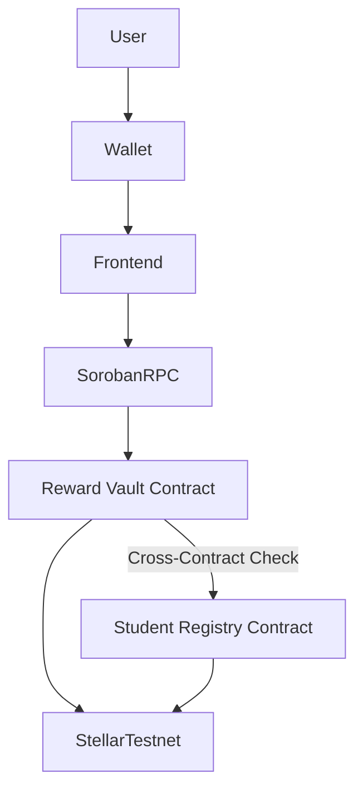

# StellarPay

### Decentralized Student Wallet & Soroban Rewards Platform

🎥 **Demo Video**

https://drive.google.com/file/d/1n7bFCVEpt_LJg8dm9rIj_mqfqmmbOjBn/view?usp=sharing (Placeholder/User Video)

🌐 **Live Demo**

[StellarPay Live App](https://stellarpay-phi.vercel.app/)

---

# Overview

StellarPay is a production-quality Stellar dApp designed specifically for students. It combines the speed of the Stellar network with the power of Soroban smart contracts to create a modern, rewarding payment ecosystem.

This repository contains both the **Soroban smart contracts** and the **Vite React frontend**, fully integrated and deployed on the Stellar Testnet.

---

# Features

- **Multi-Wallet Support**: Freighter, Albedo, Private Secret Keys, BIP-39 Recovery Mnemonics, and Read-Only Address modes.
- **Smart Contract Rewards**: Points minting and claims on the Stellar Testnet.
- **Inter-Contract Architecture**: `RewardVault` contract verifies registration on `StudentRegistry` on-chain before executing actions.
- **Real-Time Logging**: Live transaction streaming and log terminal in the explorer view.
- **High-Contrast Design**: Sleek, responsive monochromatic light/dark interface.
- **CI/CD Build Pipeline**: Automatic testing and build validation via GitHub Actions.

---

# Tech Stack

## Frontend
- React
- Vite
- Tailwind CSS & Vanilla CSS
- TypeScript

## Blockchain
- `@stellar/stellar-sdk`
- Horizon API
- Soroban RPC

## Wallets
- Freighter
- Albedo
- BIP-39 local keys

---

# Architecture



---

# On-Chain Deployments (Stellar Testnet)

- **Student Registry Contract ID**: `CBZD7SUMJYITJLX33IS3IXIIIPS7TRO5IM5TAGKJNINVY3I6O44VK56P`
- **Reward Vault Contract ID**: `CCE45FVYK5ZZHG2JHJZ5LMZKDH7P3IDBIKHE7RQLDBWEBSDZLPIX42QL`
- **Vault Link Initialization Hash**: `80a65f7740a0b589e1a9424bf98600e12ea8d2ef`

---

# Screenshots

### CI/CD Pipeline Running


### Mobile UI Screenshot 


### Test case 

---

## 🌐 Deployed Smart Contract (Level 2 Testnet Proof)

The Soroban smart contract is deployed on the Stellar Testnet:

- **Contract ID**: `CCE45FVYK5ZZHG2JHJZ5LMZKDH7P3IDBIKHE7RQLDBWEBSDZLPIX42QL`
- **Stellar.expert Explorer Link**: [Stellar.expert Testnet Explorer - Contract CCE45F...](https://stellar.expert/explorer/testnet/contract/CCE45FVYK5ZZHG2JHJZ5LMZKDH7P3IDBIKHE7RQLDBWEBSDZLPIX42QL)


# Getting Started

## Smart Contract Workspace
To run Rust contract tests locally:
```bash
cd contracts
cargo test
```

## Frontend Application
1. **Install dependencies**:
   ```bash
   npm install
   ```
2. **Run dev server**:
   ```bash
   npm run dev
   ```
3. **Build bundle**:
   ```bash
   npm run build
   ```
